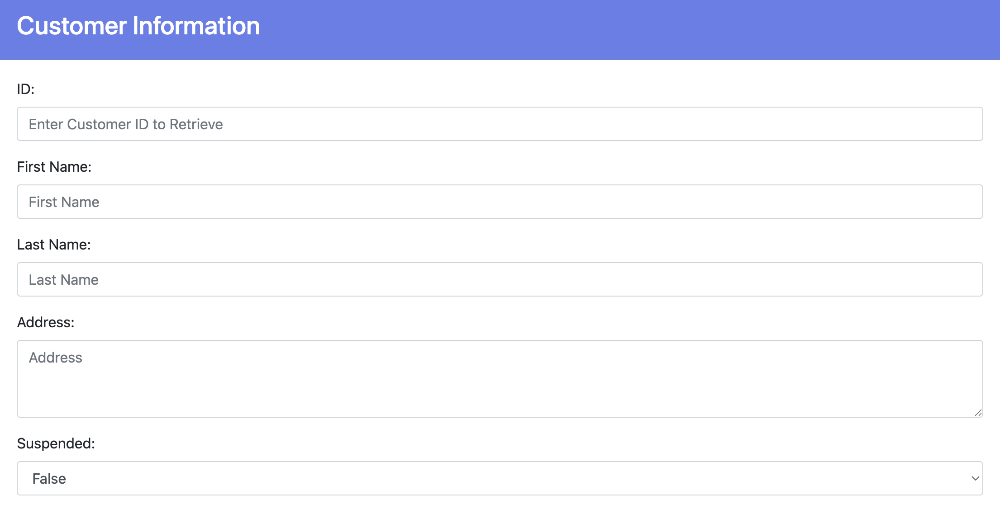
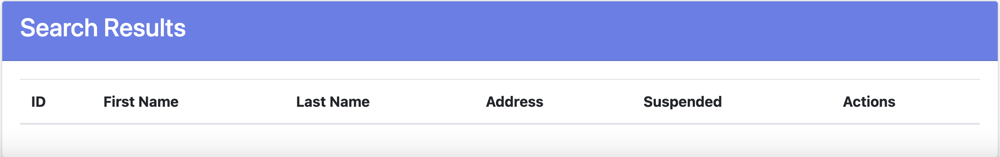
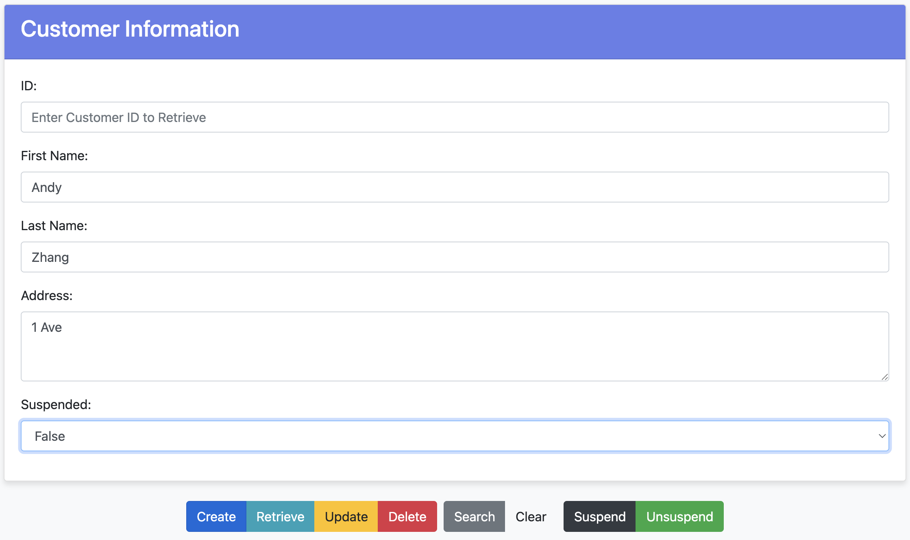
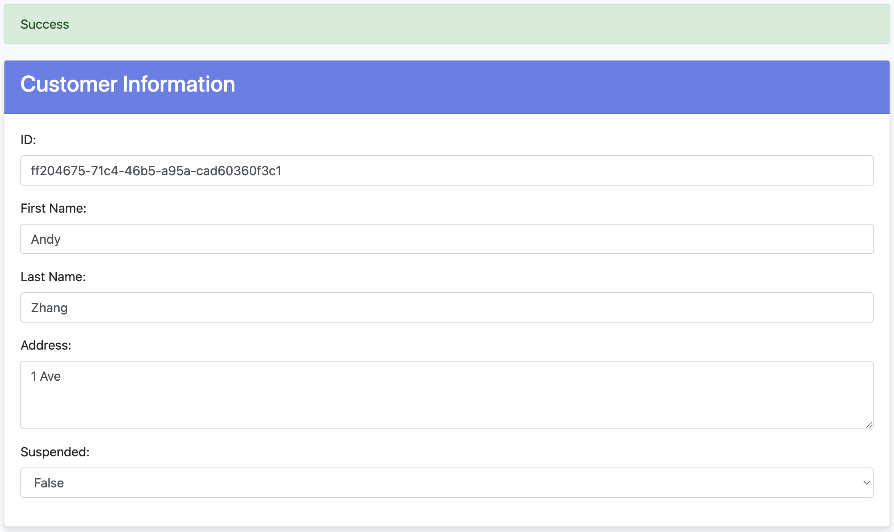
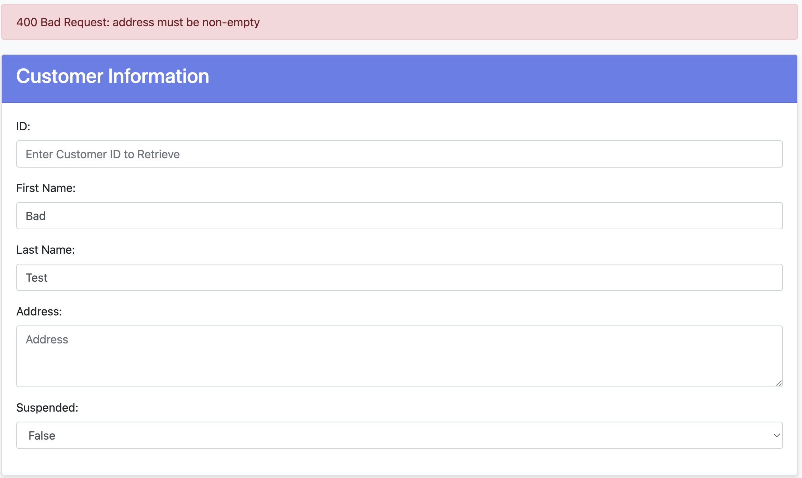
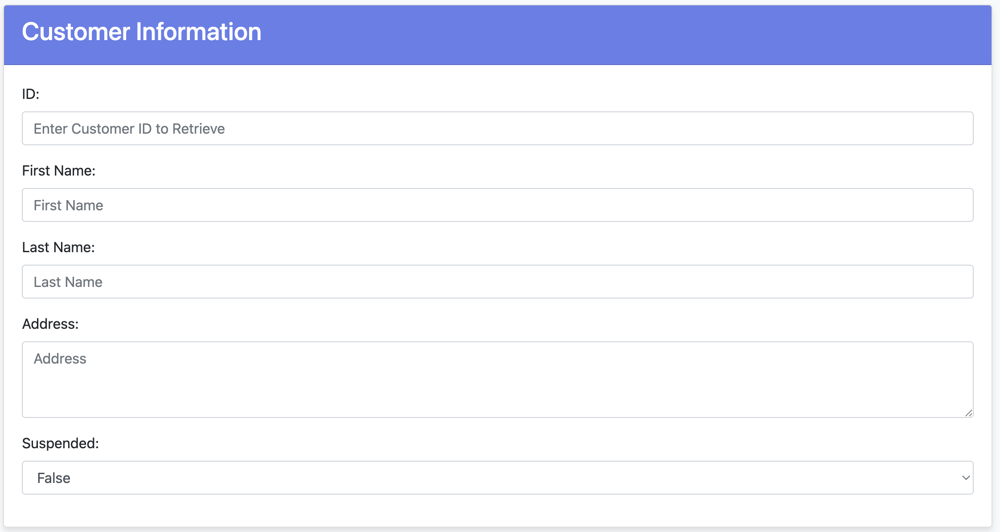
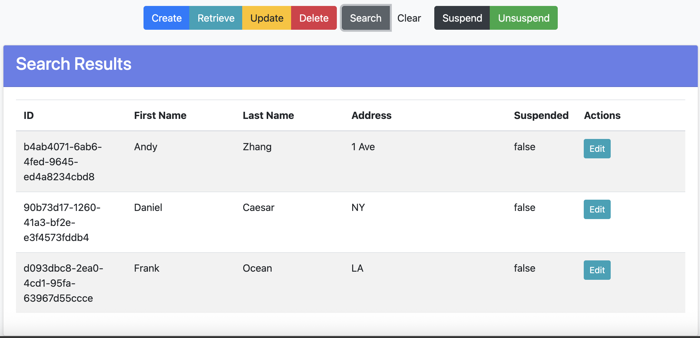

# Customers RESTful API Service

[](https://github.com/CSCI-GA-2820-FA25-003/customers/actions/workflows/ci.yml)
[](https://github.com/CSCI-GA-2820-FA25-003/customers/actions/workflows/bdd-tests.yml)
[](https://codecov.io/gh/CSCI-GA-2820-FA25-003/customers)
[](https://opensource.org/licenses/Apache-2.0)
[](https://www.python.org/)
[](https://vscode.dev/redirect?url=vscode://ms-vscode-remote.remote-containers/cloneInVolume?url=https://github.com/CSCI-GA-2820-FA25-003/customers)

## Overview

This project is a **Flask-based RESTful API with an Admin UI** for managing customer data in an e-commerce application.  
It allows clients to **create, read, update, delete (CRUD) and list** customer records via a REST API or a simple web interface. It supports filtering by first name, last name, and address.

## Getting Started

Follow these steps to clone the repository, start the development environment, and run the API.

#### 1 Clone the repository
```bash
git clone https://github.com/CSCI-GA-2820-FA25-003/customers.git
cd customers
```

#### 2 Open in VS Code Dev Container
We strongly recommend running this project in a **Dev Container** for consistent dependencies.
Make sure you have installed:

- [Docker](https://docs.docker.com/get-docker/)
- [VS Code](https://code.visualstudio.com/)
- [Remote - Containers Extension](https://marketplace.visualstudio.com/items?itemName=ms-vscode-remote.remote-containers)

Steps:

1. Open the project folder in VS Code

2. When prompted, click "Reopen in Container"

3. VS Code will automatically build and start the dev container (this may take a few minutes the first time)

#### 3 Run the Flask Application

Inside the dev container

```bash
honcho start
```
If successful, the server should start at:
```
http://localhost:8080/
```

#### 4 Using the Web Interface

The service includes an interactive HTML front-end to manage customer data and test the API endpoints directly from your browser.

Once the application is running:

1.  Open your browser and navigate to:
    ```
    http://localhost:8080/
    ```
2.  You will see the **Customers Demo RESTful Service** page.

The interface is organized into three main areas:

* **Customer Information Form (Top):**
  Use these fields to input data for creating new customers or to specify criteria for searching.
  
  

    * **ID:** Enter a specific Customer ID here for `Retrieve`, `Update`, or `Delete` actions.
    * **Fields:** Fill in First Name, Last Name, Address, and Suspended status for creation or filtering.

* **Action Buttons (Middle):**
  Use these color-coded buttons to trigger specific API calls based on the information in the form.

  

    * `Create` (Blue): Adds a new customer.
    * `Retrieve` (Teal): Fetches a single customer by the entered ID.
    * `Update` (Yellow): Modifies an existing customer based on ID.
    * `Delete` (Red): Removes the customer with the entered ID.
    * `Search` (Gray): Finds all customers matching the filled-in criteria.
    * `Clear` (Light Gray): Resets the form fields.
    * `Suspend` / `Unsuspend`: Quickly changes the suspended status of a targeted customer.

* **Search Results (Bottom):**
  The results of your operations (successful creations, search listings, etc.) will appear in this dynamic table.

  

### Example Scenario: Creating a Customer

Here is a step-by-step guide to creating a new customer record:

1.  **Fill out the Form:**
    Enter the customer's details (First Name, Last Name, Address) into the **Customer Information** section. Leave the **ID** field empty, as the database will generate this automatically.
    
    *(Example: Creating user "Andy Zhang")*
    
    

2.  **Submit and Verify:**
    Click the Blue **Create** button. 
    * A green **Success** banner will appear at the top of the page.
    * The system will assign a unique UUID to the new customer, which will automatically populate the **ID** field.
    
    

3.  **Error Handling:**
    If you attempt to create a customer without providing all required fields (e.g., leaving the **Address** empty), the system will reject the request.
    * A red banner will display the error message from the API (e.g., `400 Bad Request: address must be non-empty`).
    
    

### Example Scenario: Listing All Customers

To retrieve a full list of all customers in the database without any filtering:

1.  **Ensure Criteria is Empty:**
    Make sure the **Customer Information** form is completely blank. You can click the **Clear** button (light gray) to ensure no existing filters are applied.
    
    

2.  **Execute Search:**
    Click the Gray **Search** button.
    * Because no specific criteria (Name, Address, etc.) were provided, the system interprets this as a request to "List All".
    * The **Search Results** table will populate with every customer record currently in the database.
    
    

## Local Kubernetes Development Environment (K3d)

We use **K3d** to run a lightweight Kubernetes cluster, **`nyu-devops`**, inside Docker containers for local development and testing.

### 1. Starting the Cluster

The `make cluster` command creates a dedicated environment with an internal image registry and exposed ports.

| Cluster Name | Nodes | Internal Registry | External Access |
| :--- | :--- | :--- | :--- |
| `nyu-devops` | 1 Server (Master), 2 Agents (Workers) | `cluster-registry:5000` | Host Port **8080** maps to Ingress Port **80** |

To start the cluster, run:
```bash
make cluster
```

### 2. Verification and Component Overview

Here is a summary of the main components created, confirmed by running `kubectl get nodes` and `docker ps`:

| Component | Docker Container Example | Role in the Setup |
| :--- | :--- | :--- |
| Master Node | `k3d-nyu-devops-server-0` | The Control Plane (Brain) that manages the cluster. |
| Worker Nodes | `k3d-nyu-devops-agent-0`, `k3d-nyu-devops-agent-1` | The Worker Nodes that run our application containers (Pods). |
| Load Balancer | `k3d-nyu-devops-serverlb` | The Front Door that routes external traffic from our host machine into the cluster. |
| Image Registry | `cluster-registry` | A local Docker registry to store and pull custom images quickly. |

The status of the nodes confirms the cluster is operational:
```bash
vscode@nyu:/app$ kubectl get nodes
NAME                       STATUS   ROLES                 AGE   VERSION
k3d-nyu-devops-agent-0     Ready    <none>                13s   v1.31.5+k3s1
k3d-nyu-devops-agent-1     Ready    <none>                13s   v1.31.5+k3s1
k3d-nyu-devops-server-0    Ready    control-plane,master  15s   v1.31.5+k3s1
```

```bash
vscode@nyu:/app$ docker ps
CONTAINER ID   IMAGE                            COMMAND                  CREATED         STATUS         PORTS                                                              NAMES
c97e9e324238   ghcr.io/k3d-io/k3d-proxy:5.8.3   "/bin/sh -c nginx-pr…"   2 minutes ago   Up 2 minutes   0.0.0.0:8080->80/tcp, [::]:8080->80/tcp, 0.0.0.0:36865->6443/tcp   k3d-nyu-devops-serverlb
1327e675bb3e   rancher/k3s:v1.31.5-k3s1         "/bin/k3d-entrypoint…"   2 minutes ago   Up 2 minutes                                                                      k3d-nyu-devops-agent-1
ad40b2a9c2ac   rancher/k3s:v1.31.5-k3s1         "/bin/k3d-entrypoint…"   2 minutes ago   Up 2 minutes                                                                      k3d-nyu-devops-agent-0
497faa41de74   rancher/k3s:v1.31.5-k3s1         "/bin/k3d-entrypoint…"   2 minutes ago   Up 2 minutes                                                                      k3d-nyu-devops-server-0
c5920b211850   registry:2                       "/entrypoint.sh /etc…"   2 minutes ago   Up 2 minutes   0.0.0.0:5000->5000/tcp                                             cluster-registry
```

To get further information about the cluster run `kubectl cluster-info`. If the `make cluster` fails, you need to rebuild the container without the cache.

### 3. Key Development Usage

#### Using the Local Image Registry

When building and deploying images, we must push them to the local registry so the Kubernetes worker nodes can pull them.

1. Build the image:
  
```bash
make build
```

2. Push the image to the local registry:

```bash
make push
```

If this fails, run the following command

```bash
sudo bash -c "echo '127.0.0.1    cluster-registry' >> /etc/hosts"
```

3. Deploy the application to Kubernetes:

After building and pushing the image, deploy the entire application (PostgreSQL database and customers microservice) to the K3s cluster:

```bash
make deploy
```

This command will apply all Kubernetes manifests recursively from the `k8s/` directory, including:
- PostgreSQL StatefulSet, Service, PVC, and Secret (from `k8s/postgres/`)
- Customers Deployment, Service, and Ingress (from `k8s/`)

To verify the deployment was successful, check that all pods are running:

```bash
kubectl get pods
```

All pods should eventually reach the `Running` state.

### 4. Stopping and Deleting the Cluster

When you are finished developing, you can fully clean up the cluster and all associated Docker containers and resources using the following command

```bash
make cluster-rm
```

## API Endpoints & Example  `curl` Calls

Below are example commands you can copy and paste to test the API directly from your terminal.
These examples assume the server is running locally on `http://localhost:8080`.

##### Create a new customer
```bash
curl -X POST \
  -H "Content-Type: application/json" \
  -d '{"first_name": "John", "last_name": "Doe", "address": "123 Main Street, Anytown, USA"}' \
  http://localhost:8080/customers
```

##### Read a customer by ID
Replace `<VALID-ID-HERE>` with a valid customer ID:
```bash
curl -X GET http://localhost:8080/customers/<VALID-ID-HERE>
```

##### Update a customer by ID
Replace `<VALID-ID-HERE>` with a real customer ID returned from the list or create endpoint.
```bash
curl -X PUT \
  -H "Content-Type: application/json" \
  -d '{"first_name": "Jane", "last_name": "Doe", "address": "456 Elm Street, Cityville, USA"}' \
  http://localhost:8080/customers/<VALID-ID-HERE>
```

##### Delete a customer by ID
Replace `<VALID-ID-HERE>` with a valid customer ID:
```bash
curl -X DELETE http://localhost:8080/customers/<VALID-ID-HERE>
```

##### Retrieve all customers
```bash
curl -X GET http://localhost:8080/customers
```

##### Filter customers by first name

Replace `<FIRST_NAME>` with the customer's first name you want to search for:
```bash
curl -X GET "http://localhost:8080/customers?first_name=<FIRST_NAME>"
```

##### Filter customers by last name

Replace `<LAST_NAME>` with the customer's last name you want to search for:
```bash
curl -X GET "http://localhost:8080/customers?last_name=<LAST_NAME>"
```

##### Filter customers by address

Replace `<ADDRESS>` with the customer's address you want to search for:
```bash
curl -X GET "http://localhost:8080/customers?address=<ADDRESS>"
```

##### Filter customers by first name and last name
Replace `<FIRST_NAME>` and `<LAST_NAME>` with valid values:
```bash
curl -X GET "http://localhost:8080/customers?first_name=<FIRST_NAME>&last_name=<LAST_NAME>"
```

##### Filter customers by first name and address
Replace `<FIRST_NAME>` and `<ADDRESS>` with valid values:
```bash
curl -X GET "http://localhost:8080/customers?first_name=<FIRST_NAME>&address=<ADDRESS>"
```

##### Filter customers by last name and address
Replace `<LAST_NAME>` and `<ADDRESS>` with valid values:
```bash
curl -X GET "http://localhost:8080/customers?last_name=<LAST_NAME>&address=<ADDRESS>"
```

##### Filter customers by first name, last name, and address
Replace `<FIRST_NAME>`, `<LAST_NAME>,` and `<ADDRESS>` with valid values:
```bash
curl -X GET "http://localhost:8080/customers?first_name=<FIRST_NAME>&last_name=<LAST_NAME>&address=<ADDRESS>"
```

## Project Structure

```text
.gitignore          - this will ignore vagrant and other metadata files
.flaskenv           - Environment variables to configure Flask
.gitattributes      - File to gix Windows CRLF issues
.devcontainers/     - Folder with support for VSCode Remote Containers
dot-env-example     - copy to .env to use environment variables
pyproject.toml      - Poetry list of Python libraries required by your code

.
├── Dockerfile          - Dockerfile for building the image
├── Makefile            - Makefile with build targets
├── Procfile            - Procfile for honcho to start the service
├── README.md           - This file
├── features/           - (NEW) BDD Acceptance Tests
│   ├── customers.feature  - Gherkin feature file
│   ├── environment.py     - Selenium setup
│   └── steps/             - BDD steps definitions
├── k8s/                - Kubernetes deployment files
├── service/            - Service python package
│   ├── __init__.py     - Package initializer
│   ├── config.py       - Configuration parameters
│   ├── models.py       - Business models
│   ├── routes.py       - Service routes
│   ├── common/         - Common code package
│   └── static/         - (NEW) Web UI Static Assets
│       ├── css/        - Stylesheets
│       ├── index.html  - Main UI page
│       └── js/         - JavaScript for REST API interaction
├── tests/              - Unit tests package
│   ├── factories.py    - Factory for testing with fake objects
│   ├── test_models.py  - Test suite for business models
│   └── test_routes.py  - Test suite for service routes
└── wsgi.py             - WSGI entry point
```

## License

Copyright (c) 2016, 2025 [John Rofrano](https://www.linkedin.com/in/JohnRofrano/). All rights reserved.

Licensed under the Apache License. See [LICENSE](LICENSE)

This repository is part of the New York University (NYU) masters class: **CSCI-GA.2820-001 DevOps and Agile Methodologies** created and taught by [John Rofrano](https://cs.nyu.edu/~rofrano/), Adjunct Instructor, NYU Courant Institute, Graduate Division, Computer Science, and NYU Stern School of Business.
